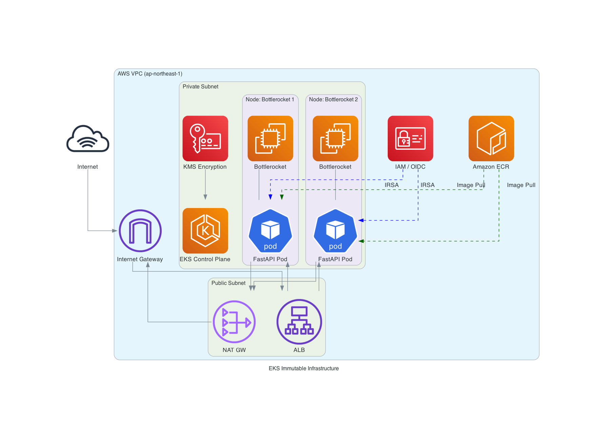

# EKS Color API — Hardened FastAPI on Kubernetes (AWS)

A portfolio-grade demo featuring a containerized FastAPI service deployed on AWS EKS using Modular Terraform (IaC). This project emphasizes high-security standards (Hardening) and follows Immutable Infrastructure principles.

Developed to bridge the gap between CKA/CKS concepts and production-ready AWS environments.

---

## 🏗️ Architecture

Designed with a clear separation between **Network** and **Compute** layers for maximum isolation.




---

## 🌟 Key Features (Hardened Focus)

- **Immutable Infrastructure** – Bottlerocket OS for EKS managed node groups (read-only root FS, no SSH).
- **Modular IaC** – Reusable Terraform modules (VPC, EKS) following DRY principles.
- **Network Isolation** – All nodes live in 100% private subnets.
- **Secrets Encryption** – AWS KMS envelope encryption for Kubernetes secrets.
- **Fine‑grained IAM** – OIDC & IRSA for least-privilege pod identity.
- **Cost Efficiency (FinOps)** – EC2 Spot instances for node groups.

---

## 📂 Project Structure

```text
eks-color-api/
├── app/                     # FastAPI source code
│   └── main.py
├── infra/
│   ├── modules/             # Reusable blueprints
│   │   ├── vpc/             # Networking: subnets, NAT, IGW, routing
│   │   │   ├── main.tf, variables.tf, outputs.tf
│   │   └── eks/             # Compute: cluster, node groups (Bottlerocket)
│   │       ├── main.tf, variables.tf
│   └── environments/
│       └── dev/             # Live deployment
│           ├── main.tf      # Root module wiring VPC & EKS
│           ├── providers.tf # AWS, K8s, Helm provider configs
│           └── terraform.tfvars
├── Dockerfile
└── README.md
```

---

## 🚀 Getting Started

1. **Infrastructure provisioning**
   ```bash
   cd infra/environments/dev
   terraform init
   terraform plan
   terraform apply
   ```

2. **Cluster connectivity**
   ```bash
   # update local kubeconfig
   aws eks update-kubeconfig --region ap-northeast-1 --name hardened-eks-cluster

   # verify nodes
   kubectl get nodes
   ```

---

## 🛠️ Tech Stack & Skills

- **Cloud:** AWS (VPC, EKS, ECR, KMS, IAM)
- **IaC:** Terraform (advanced modules, version pinning, dynamic AZ fetching)
- **Kubernetes:** CKA/CKS aligned (RBAC, IRSA, network policies, managed Bottlerocket)
- **Backend:** Python FastAPI, Docker

---

## 📈 Roadmap & Status

| Phase | Description                                                                 | Status |
|-------|-----------------------------------------------------------------------------|:------:|
| 1     | Containerize FastAPI app and verify locally.                               | ✅     |
| 2     | Design & provision hardened VPC and EKS via modular Terraform.             | ✅     |
| 3     | Setup Amazon ECR and CI/CD for automated image builds. (WIP)               | ⏳     |
| 4     | Deploy application manifests (Deployment, Service, HPA) and ALB Ingress.   | ⏳     |

> **Cost awareness:** This lab provisions real AWS resources (NAT gateway, EKS cluster). Remember to run `terraform destroy` when finished to avoid charges.

